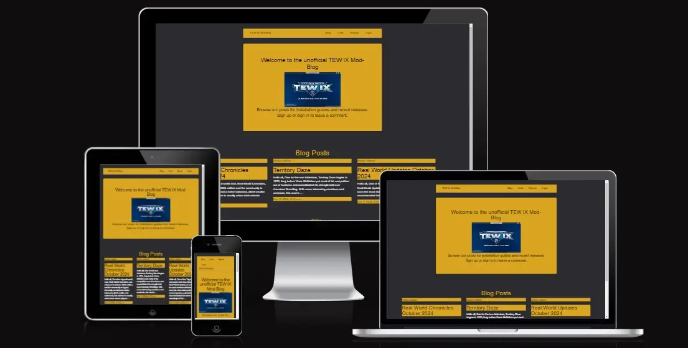
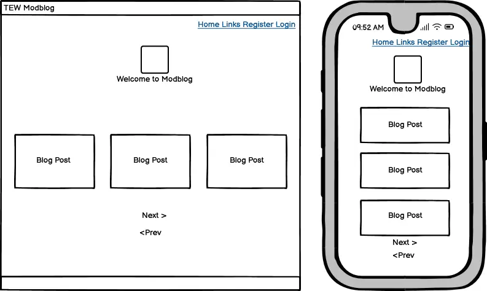
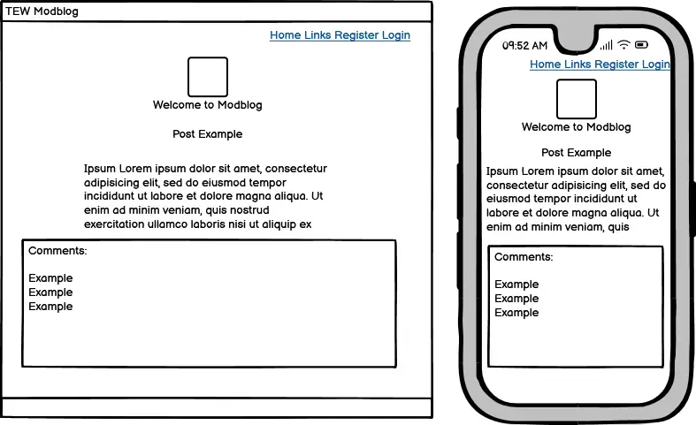
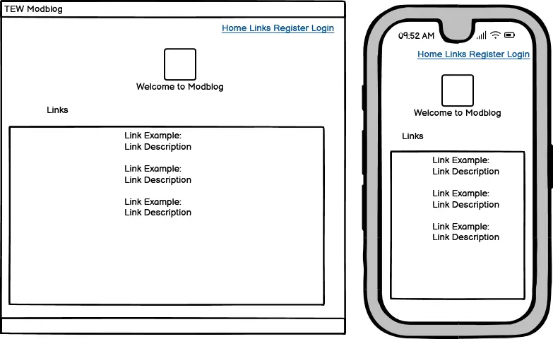
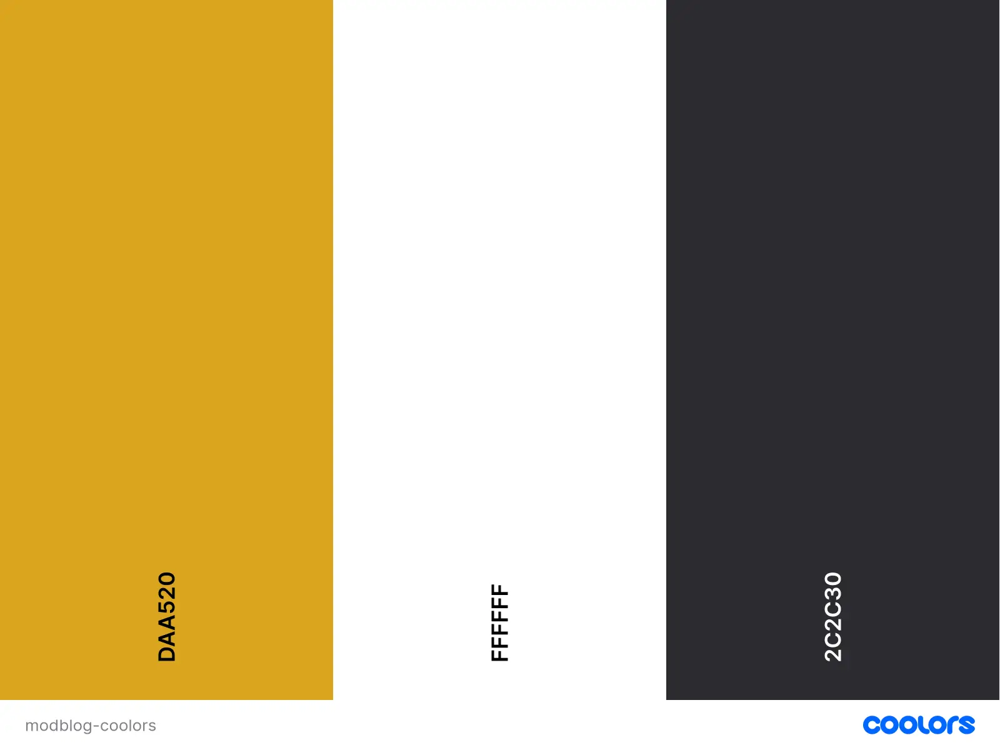

# The Unofficial TEW IX Mod-Blog
The Unofficial TEW IX Mod-Blog is a website designed to present streamlined information regarding mod releases for TEW IX.

Total Extreme Warfare (TEW) is a game originally developed in 1995 as Extreme Warfare by programmer Adam Ryland. A complex simulator for wrestling, the game has seen twelve iterations total and nine under the TEW moniker, the most recent of which released in 2024. The game boasts its own internal fantasy world of wrestling promotions but fully supports mods to produce any number of interesting, real-life scenarios.

The GreyDog Software(GDS) forums provide a hub for discussing, uploading and downloading mods. However, the forums can be very overwhelming for new players as the community serves a very niche pool of players who have mostly been playing for years. As such, the forums can be difficult for aspiring players to navigate, as I learned when I started playing the 2016 version of the game.

The Unofficial TEW IX Mod-Blog is envisioned as a streamlined place to find information regarding upcoming mods and current releases for new players who have not yet been fully integrated into the community. Like any niche endeavour, the forums are full of in-jokes and memetic posts that can be very confusing for new players; the hope is that this website can provide more general information on how to approach modding the game and hopefully serve as a palatable bridge for those who wish to try the game for themselves using real-life companies and workers.

[Live Deployment](https://tewmodblog-2cfe2f71314a.herokuapp.com/)

# Design & Planning
## User Stories
- As a user I want to
  - Easily and intuitively navigate the website
  - Register for an account so I can contribute
  - Have control over my contributions
  - Logout and Login with ease
  - Understand each posts intention without clicking into it
  - Click into and view any post I'm interested in
  - Browse a set of resources related to the website

 The above will be addressed under Testing below
 
## Wireframes
The Wireframes for this website were designed using Balsamiq and have been mostly adhered to. A Bootstrap 3 theme, Jumbotron Narrow, was used and modified to suit the needs of the project as it closely resembled the desired layout and allowed for increased focus on the more technical aspects of the code. This theme had many components altered in order to more closely represent the intentions laid out in the wireframes below.

#### Wireframe for Homepage:

#### Wireframe for Blog Posts:

#### Wireframe for External Resources:

## Agile Methodology
This website was designed using an Agile Methodology. Features for this project were planned ahead of time and tracked using a Kanban Board which was hosted on the programmers Github profile.

This can be seen [here](https://github.com/users/AdamFcode/projects/2)

## Typography
Standard fonts were used across the project to mimic the style of presentation on the GDS forums and in the game itself. TEW has often been lovingly declared a "spreadsheet simulator", with the outdated UI and lack of animation pointed out to support this. For better or for worse, the stripped down style of TEW is one of the major things, along with its internal complexity, that has differentiated it from its competition over the years. Most players are quite fond of this barebones approach and so it was decided to emulate this for the website.

## Colour Scheme
Once again, it was decided to mimic the general presentation of TEW with a basic colour palette, one inspired by TEW 2016 specifically. A dark grey tone was used for background colours with gold implemented for headlines and highlights. 

Text was originally presented using a Royal Blue, similar to the text colour used both in-game and on the GDS forums. This returned problems during lighthouse testing with readibility which were initially deemed acceptable. However, the project mentor pointed out the dull contrast which led to the text colour being reevaluated. Standard white was settled upon as the text colour as it provided the most readability without straying to far from the generally drab tones of TEW.

#### Colour Palette

## Database Schema

# Features

# Testing

# Bugs

# Deployment

# Credits 
