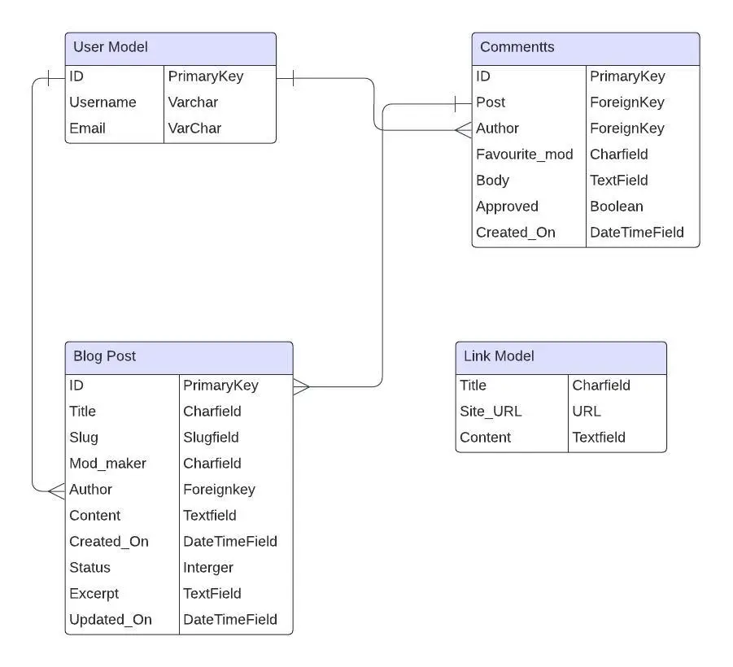

# The Unofficial TEW IX Mod-Blog
The Unofficial TEW IX Mod-Blog is a website designed to present streamlined information regarding mod releases for TEW IX.

Total Extreme Warfare (TEW) is a game originally developed in 1995 as Extreme Warfare by programmer Adam Ryland. A complex simulator for wrestling, the game has seen twelve iterations total and nine under the TEW moniker, the most recent of which released in 2024. The game boasts its own internal fantasy world of wrestling promotions but fully supports mods to produce any number of interesting, real-life scenarios.

The GreyDog Software(GDS) forums provide a hub for discussing, uploading and downloading mods. However, the forums can be very overwhelming for new players as the community serves a very niche pool of players who have mostly been playing for years. As such, the forums can be difficult for aspiring players to navigate, as I learned when I started playing the 2016 version of the game.

The Unofficial TEW IX Mod-Blog is envisioned as a streamlined place to find information regarding upcoming mods and current releases for new players who have not yet been fully integrated into the community. Like any niche endeavour, the forums are full of in-jokes and memetic posts that can be very confusing for new players; the hope is that this website can provide more general information on how to approach modding the game and hopefully serve as a palatable bridge for those who wish to try the game for themselves using real-life companies and workers.

[Live Deployment](https://tewmodblog-2cfe2f71314a.herokuapp.com/)

# Design & Planning
## User Stories
- As a user I want to
  - Easily and intuitively navigate the website
  - Register for an account so I can contribute
  - Have control over my contributions
  - Logout and Login with ease
  - Understand each posts intention without clicking into it
  - Click into and view any post I'm interested in
  - Browse a set of resources related to the website

 The above will be addressed under Testing below
 
## Wireframes
The Wireframes for this website were designed using Balsamiq and have been mostly adhered to. A Bootstrap 3 theme, Jumbotron Narrow, was used and modified to suit the needs of the project as it closely resembled the desired layout and allowed for increased focus on the more technical aspects of the code. This theme had many components altered in order to more closely represent the intentions laid out in the wireframes below.

#### Wireframe for Homepage:

#### Wireframe for Blog Posts:

#### Wireframe for External Resources:

## Agile Methodology
This website was designed using an Agile Methodology. Features for this project were planned ahead of time and tracked using a Kanban Board which was hosted on the programmers Github profile.

This can be seen [here](https://github.com/users/AdamFcode/projects/2)

## Typography
Standard fonts were used across the project to mimic the style of presentation on the GDS forums and in the game itself. TEW has often been lovingly declared a "spreadsheet simulator", with the outdated UI and lack of animation pointed out to support this. For better or for worse, the stripped down style of TEW is one of the major things, along with its internal complexity, that has differentiated it from its competition over the years. Most players are quite fond of this barebones approach and so it was decided to emulate this for the website.

## Colour Scheme
Once again, it was decided to mimic the general presentation of TEW with a basic colour palette, one inspired by TEW 2016 specifically. A dark grey tone was used for background colours with gold implemented for headlines and highlights. 

Text was originally presented using a Royal Blue, similar to the text colour used both in-game and on the GDS forums. This returned problems during lighthouse testing with readibility which were initially deemed acceptable. However, the project mentor pointed out the dull contrast which led to the text colour being reevaluated. Standard white was settled upon as the text colour as it provided the most readability without straying to far from the generally drab tones of TEW.

#### Colour Palette

## Database Schema

# Technologies and Languages Used
The following were used for this project:
- HTML5

- CSS3

- JavaScript

- Python

- Django

-  PostgreSQL

-  Bootstrap3

-  Heroku

-  Gunicorn

-  Whitenoise

-  Psycopg2-Binary

# Features
* Note: As noted above in Colour Scheme, the text colour for the website was changed from royal blue to white late in development for the sake of readability. As a result of project deadlines, the following images showcase the original text colour. The change can be seen in the live deployment of the website but unfortunately there was not enough time to capture and upload new images showcasing this change.
  
## Navbar
The top of the website has a navbar to allow easy navigation of the site. It includes an anchor for the homepage, titled as TEW IX Modblog. The navigational links change depending on the login status of the user. 'Blog' and 'Links' appear regardless of login status. Should the user not be logged in, they're are presented with 'Signup' and 'Login'. If the user is already logged in, these two options are replaced with 'Logout'.

* Note, the 'Blog' navigation was initially listed as 'Home'. The project mentor recommended that this be changed as the Home Page serves as the Blog Posts page and it led to confusion when navigating the website. As this was pointed out late in development, the below image showcases the original 'Home' navigation, though this change has been made on the deployed website. The same is true of the 'Signup' navigation, which initially read 'Register'.

## Jumbotron
A jumbotron sitting at the top of each page provides a description of the website's intent along with an inset image of TEW IX's main-menu image. It also recommends that users either Signup or Sign in  to leave a comment. 

## Blog Preview
Below the jumbotron on the 'Blog' homepage, three blog post previews are presented. These previews provide the title, author, upload date and a truncated excerpt of the blog content, allowing the user to see whether the specific blog post is of any interest to them.

## Blog Post Pagination
Three preview blog posts are displayed to the user, deemed the ideal amount before the page became overly cluttered. Below these posts is a 'next' button to allow the user to scroll through different blog posts. Once clicked, a 'previous' button appears allowing the user to scroll back the way they came. Should they reach the last page, the next button is then hidden.

## Singular Blog Post
Upon clicking on the desired post, the user is shown the full post complete with a comment section below. The post also lists the GDS username of the individual or individuals who made the associated mod. The users login status dictates what functionality is presented to them in the comment section (covered further down).

## Links Section
Hoping to curtail any unrelated links from being commented on the website, a ban against any links whatsoever has been instigated, with a dedicated section open to users to navigate off-site to related, trusted domains. This was done via a Model so that the SuperUser can change these links through the admin panel. These links have titles that lead to the listed website when clicked upon and a short description of the site in question.

## Signup
Signing up for the website is easy, with a form given to the user to fill out before being submitted. This form captures basic information with the email section being optional. 

Should the user input incorrect information, they receive a feedback message which lets them know that a mistake has been made.

Upon signing up successfully, a mesage is related to the User to inform them that they are now signed into the website under their chosen username.

## Comments 
Once signed in, a textfield appears beside the comments section of each blog post, allowing the user to leave a comment if they wish. These comments require approval in the admin panel in order to moderate content.

Should the user decide to leave a comment, they receive a message to confim their comment submission and to inform them that they're awaiting approval.

Once a comment is aprroved it can be seen by all. The user is also presented with two buttons below their comment; one to edit their comment and the other to delete it.

Should they click the edit button, the comment textfield becomes auto-populated with their current comment, allowing them to edit it. The submit button is also replaced with an update button.

Upon clicking update, the user is presented with an update success message and, as seen below, their comment is updated to the current state.

Should the user decided to delete their comment, they can click the delete button. This will bring up a modal for them to confirm whether they want to delete their comment or not. Should they close the modal, their comment will remain untouched.

If the user confirms the deletion, the comment will be removed and they will be given a notification informing them of the successful deletion.

## Signing Out
The Logout option provides the user with a sign out button. This extra step was added to ensure that any user who accidentally clicked the Logout button does not have to then go through the process of signing in again.

If this button is clicked, the user is signed out, provided with a message to confirm this and the navbar gets reset to the state any unregistered user is presented with.

## Signing In
When a user returns and clicks on the Login button, they will be redirected to a form requesting their user details.

If incorrect information is entered, the user is presented with a message informing them that their username/password is invalid.

Once the user has entered the correct information, they are redirected to the Blog Posts page and given a notification confirming their successful sign in.

## Footer
A simple, themeatically consistent footer was decided upon, displaying only the name of the programmer. 

# Features Earmarked for Future Implementation 
## User Blog Posts
The implementation of a model that would allow users to post their own blogs was considered but ultimately decided against at this stage of development. The reason for this was the unproven community of the blog. Once a genuine community of TEW enthusiasts is built that can be relied upon to post relevant content, the feature will be implemented.

## Unbanning of Links
Allowing users to comment links without fear of removal is understood to be more ideal than navigating to the links site and finding the domain a commentator may have mentioned. However, this was decided against for the current build until, once again, a reliable community who will not troll the blog posts has been built up.

## Multiple Blog Sections
A feature that could not be implemented in the allotted time was seperate blog sections that dealt with different aspects of the game. For instance, one section for mod releases, another for tech updates, another for general discussion etc. This is one of the primary focuses of future development and will be better suited to the website once users have the ability to post their own blogs.

## User Profile
A user profile section to increase the interactivity between users was considered but deemed unable to complete within the timeframe allotted to the project. Future builds will implement this feature in order to increase user engagement.

## Comment Approval Notification
Once a user profile section has been implemented, the intention is to provide an internal inbox for each user where they will receive updates on their comment status from admin. Supported messaging between users was considered in conjunction with this future feature but decided against as it was deemed unneccesary.

# Testing
## User Stories
As a user I want to easily and intuitively navigate the website
- The navbar works perfectly as intended and displays the correct options dependant on user status.

As a user I want to register for an account so I can contribute
- The register link on the navbar directs the user to a form which provides guidance and input fields for registering.
- Any incorrect information is brough to the users attention and they receive a notification upon successful registration.
- Once registered, the user has the ability to post comments under the blog posts.

As a user I want to have control over my contributions
- The user is given the option to edit or remove his comments.
- The user is asked to confirm whether they intended to edit or delete their comment.
- The user is notified of successful or failed attempts to edit or delete their comment.

As a user I want to logout and Login with ease
- The navbar provides intuitive navigation to the relevant sections.
- Login attempts provide a form with clear instructions.
- Logout asks the user to confirm whether their logging out.
- The user is notified of successful or failed attempts to login or logout.

As a user I want to understand each posts intention without clicking into it
- The user can view a selection of blog posts from the homepage.
- Each blog post provides a title and excerpt to indicate what the content is about.
- The posts are presented in order of most recently posted

As a user I want to click into and view any post that I'm interested in.  
- Each truncated blog post has a title which leads to the actual post if clicked.
- The user is successfully redirected to whichever post they click on.

As a user I want to browse a set of resources related to the website
- Clicking links in the navbar redirects the user to a list of relevant resources.
- Each resource has a short description of the website's functionality and relevancy.
- Clicking on the title opens the selected website in a new tab.

## Manual Testing
### Navigation
**Task**: Navigate website

**Steps**: Selected each option along the navbar from every app to ensure that they led to the intended pages.

**Status**: Success.

### Registration
**Task**: Register as User

**Steps**: Clicked on Signup in navbar. Filled out the form following the guidelines and was presented with a notification confirming my registration. 

**Status**: Success

### Logout
**Task**: Logout successfully 

**Steps**: Clicked on logout in navabar. Presented with confirmation button. Upon clicking on button, redirected to homepage and given notification to confirm logout. Could no longer comment.

**Status**: Success

### Login
**Task**: Login successfully 

**Steps**: Clicked on login in navbar. Filled out form with relevant information. Was redirected to homepage and notified of successful login. Could comment as logged in user.

**Status**: Success

### Comment
**Task**: Leave a comment

**Steps**: Entered comment into provided text field. Clicked submit. Received notification confirming comment submission with approval pending advised.

**Status**: Success

### Edit Comment
**Task**: Edit a comment

**Steps**: Navigated to comment left prior and clicked the edit button. Textfield was populated with my current comment and allowed me to make changes. Submit button was replaced with update button. Once clicked, received a notification confirming the update. Checked the comment section and verified the change on different profile.

**Status**: Success

### Delete Comment 
**Task**: Delete a comment

**Steps**: Navigated to comment left prior and clicked the delete button. Presented with modal confirming selection. Received notification to confirm comment had been deleted once I clicked the button. Checked the comment section and verified deletion on different profile.

**Status**: Success

### Links
**Task**: Navigate to relevant website from links section

**Steps**: Navigated to link section of website. Clicked each header, ensuring that it brought the user to the listed website. Also ensured the links opened in new tabs.

**Status**: Success

## Validator Testing
The HTML was tested on the official W3C Validator and passed for most files.

The link.html document returned errors due to p tags being a child element of a h4 tag. However, as this information was populated by the model and the validation was done later in project development, the issue could not be resolved.

The Sign Up form also returned errors but these could not be addressed as it was populated by an outside resource.

The CSS was tested on the official Jigsaw Validator and showed no errors.

The JavaScript was tested on jshint and showed no errors.

The python was tested on CI Pylint and showed no errors.

## Lighthouse Testing
The testing on both desktop and mobile returned satisfactory scores

Desktop:

Mobile:

# Bugs
## Resolved Bugs
### Delete Modal
Much of the troubleshooting for this project was concerned with the delete modal for the comment section. The modal appeared and the delete button within worked properly but the issue was with the close button within the modal. Once clicked, the close button did not remove the modal. The website would have to be reloaded in order to get rid of it.

After several unsuccessful attempts to fix it by troubleshooting on stackoverflow, it was decided to place a function in the script of the base html file that manually provided the functionality of closing the modal when the close button was clicked.

### CSS Issues
A relatively minor and easily fixed issue presented itself where my custom css was not overwriting the bootstrap css classes provided in the Jumbotron Narrow template.

Luckily, I found many posts online addressing similar issues and through trial and error managed to correct the issue by properly loading the static files into the effected html files.

## Unresolved Bugs
### Error 404 Page
A custom error 404 page was implemented for the project which now instead renders a basic service error 500 message. The custom error page was confirmed by the programmer when implemented but must have lost functionality when other code was implemented. Due to debug being set to true, the bug was not discovered until late in development and could not be corrected.

### Navbar on Mobile
When viewed on a mobile, the elements in the navbar stack in awkward manner and remove the grey space between the navbar and the jumbotron. This issue occured when the wording used in the navbar was changed and when slight changes were implemented to the css. Due to the project deadline the issue could not be fixed.

# Deployment
The project was deployed to Heroku using GitHub as a repository.
Deployment required an Heroku account to host the app. Once an account was created, the following steps were followed:
* From the Heroku dashboard, select new in the upper right corner, followed by create new app.
* Enter an appropriate app name and select region, which was EU in this case.
* Select Create New App
* Under settings, select Reveal Config Vars. Enter PORT as a key with 8000 as the value and then add.
* Return to deployment and select deployment method which was GitHub in this case.
* Enter the relevant repository source and connect.
* Select deploy from branch which provided a landing page on Heroku for your app.
* In the top right, select "Open App" to launch in a new window

# Credits 
## Content
- The code used for Pagination, the navbar and the comment form was sourced from the I Think Therefore I Blog walkthrough project.
- The Bootstrap3 Jumbotron Narrow template was used and modified for CSS elements
- All blog and comment content was written by the programmer.

## Media
- The inset picture within the jumbotron was sourced from the GDS forums.
- Tinypng was used to compress the readme images

## Special Thanks
- Tutors, mentors, classmates et al at Code Institute
- Adam Ryland
- GreyDog Software
- The TEW community and modders
- The community at stackoverflow

